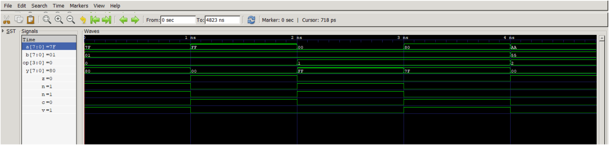

# 🧠 Mini ALU & Self-Checking Testbench (Verilog)

**Author:** Sameer Syed  
Master’s Student – Electrical and Computer Engineering, Purdue University  
Focus: VLSI Design & Verification  
Email: sameersyed7702@gmail.com  
GitHub: https://github.com/SamSyed7702

---

### Overview
This project implements a **parameterized 8/16-bit Arithmetic Logic Unit (ALU)** in **Verilog**, along with a **self-checking testbench** verified using open-source tools (**Icarus Verilog** and **GTKWave**).

It demonstrates RTL design, functional verification, and waveform analysis — foundational skills for **front-end VLSI and ASIC verification** roles.

---

### 🚀 Features
- Configurable **8-bit / 16-bit ALU**
- Arithmetic and logic operations with **Z/N/C/V** flags
- **Self-checking testbench** (no manual checking)
- Both **directed** and **randomized** tests
- Verified using **open-source tools**

---

### 🧮 Supported Operations

| Opcode | Operation | Description |
|:-------|:-----------|:-------------|
| 0x0 | ADD | `y = a + b` |
| 0x1 | SUB | `y = a - b` |
| 0x2 | AND | Bitwise AND |
| 0x3 | OR  | Bitwise OR |
| 0x4 | XOR | Bitwise XOR |
| 0x5 | NOT | Bitwise NOT (A) |
| 0x6 | SLL | Logical left shift |
| 0x7 | SRL | Logical right shift |
| 0x8 | SRA | Arithmetic right shift |
| 0x9 | SLT | Set if signed(A) < signed(B) |
| 0xA | PASSA | Output A |
| 0xB | PASSB | Output B |
| Others | — | Output = 0 |

---

### 🧰 Tools Used

| Tool | Version | Purpose |
|------|----------|----------|
| Icarus Verilog | 12.0 | Compilation and simulation |
| GTKWave | Latest | Waveform visualization |
| Visual Studio Code | Latest | Source editing and integration |

---

### ⚙️ How to Run

```bash
# Compile
iverilog -g2001 -o alu_tb tb_alu.v alu.v

# Run Simulation
vvp alu_tb

# View Waveform
gtkwave alu_tb.vcd
```

Expected terminal output:
```
ALL TESTS PASSED ✅
```

---

### 🖼 Example Waveform

Example: **ADD Overflow Test**  
Inputs: `a=0x7F`, `b=0x01`, `op=0 (ADD)`  
Output: `y=0x80`, Flags → `Z=0, N=1, C=0, V=1`  
This demonstrates a **signed overflow** when adding +127 and +1 → -128.



---

### 📂 Folder Structure

```
mini_alu_project/
├── alu.v
├── tb_alu.v
├── README.md
├── waveform_example.png
└── .gitignore
```

---

### 📈 Test Results Summary

| Test Type | Description | Status |
|------------|--------------|--------|
| Directed | Arithmetic, logic, shift edge cases | ✅ Passed |
| Randomized | 200 random operations | ✅ Passed |
| Flags | Zero/Negative/Carry/Overflow | ✅ Verified |

---

### 🎯 Skills Demonstrated
- RTL design and parameterization in Verilog  
- Functional verification & self-checking testbenches  
- Randomized test generation  
- Open-source EDA flow (Icarus + GTKWave)  
- Debugging with waveform viewers  
- Documentation and GitHub project presentation

---

### 🏷 Resume Summary

**Mini ALU & Self-Checking Testbench — Verilog, Icarus, GTKWave**  
Designed and verified a parameterized 8/16-bit ALU supporting arithmetic and logic operations with status flags.  
Built a self-checking testbench with directed and random tests, verified functionality using open-source EDA tools.  
Demonstrated strong RTL design and verification methodology skills.
